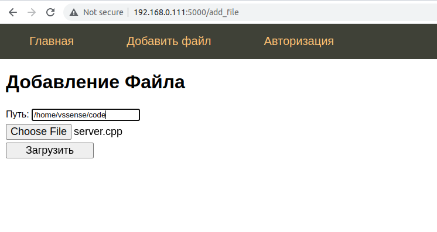

# Files explorer

Программа для шеринга файлов с компьютера по локальной или глобальной сети.

## Installation

```shell
$ git clone https://github.com/baranov-V-V/FilesExplorer.git
$ cd FilesExplorer
$ ./run.sh
```

## Description

Можно посмотреть содержимое файлов, для файлов с кодом работает подсветка синтаксиса и номера строк.
Можно загрузить новый файл в указанное место, перед этим нужно авторизоваться или зарегистрироваться. \
IP берется из ifconfig'а, можно заменить на другой.

